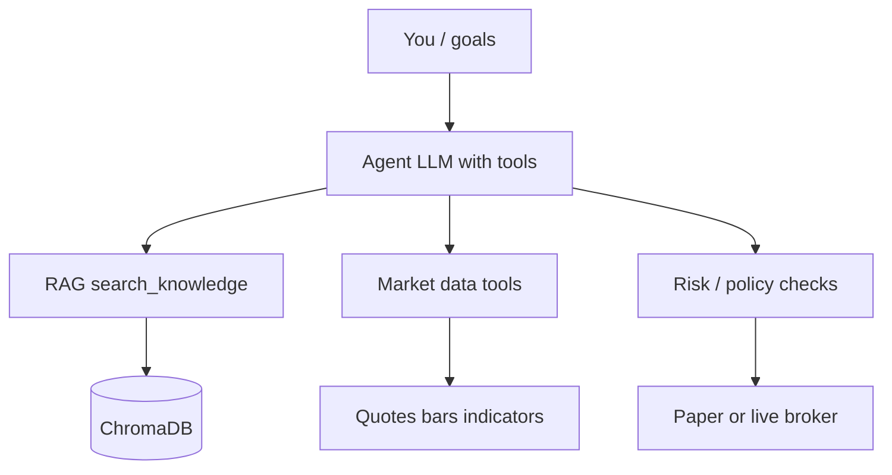

# Agentic Trading Roadmap

Conceptual plan for building an agentic trading workflow on top of this
project's local RAG server and Ollama stack. This document describes architecture
and phases—not a trading system, financial advice, or live execution guide.

**Current stack:** FastAPI RAG (`/ingest`, `/query`), ChromaDB, Ollama
(`llama3.2:3b`, `nomic-embed-text`, `moondream` for figure captions at ingest).
Example corpus: `murphy-digital` (Murphy technical analysis book, text + embedded
chart captions).

---

## 1. Core idea: three layers

Split the problem into three brains, not one:

| Layer | Role | Status in this repo |
|-------|------|---------------------|
| **Knowledge** | Rules, definitions, frameworks from ingested books | RAG (`murphy-digital`) |
| **Agent** | Plan, call tools, iterate, explain | Not built yet |
| **Execution** | Prices, orders, positions, risk | Not in repo |

- RAG answers: *"What does Murphy say about X?"*
- An agent answers: *"Given my thesis, market state, and rules, what should I do next?"*
- A broker/exchange API actually executes (paper first, live much later).



---

## 2. Define scope first

Be explicit about what "agentic trading" means for your deployment:

| Mode | Behavior |
|------|----------|
| **Research agent** | Scans book + captions, drafts trade thesis, no orders |
| **Signal agent** | Maps thesis to indicators/patterns, still no orders |
| **Execution agent** | Places paper trades under hard rules |
| **Full loop** | Research → signal → size → order → monitor → exit |

**Recommendation:** start with research + paper only. Live trading is a late
phase with human approval and separate risk controls.

---

## 3. Turn RAG into agent tools

Expose the RAG server as callable tools rather than making the agent *be* the
RAG pipeline.

| Tool | Purpose |
|------|---------|
| `search_knowledge(query, top_k)` | Text + figure captions from ingested corpus |
| `get_source_chunk(source, id)` | Full chunk for citation |
| `get_figure(page)` | Load figure image + stored caption |
| `describe_figure(page, question)` | Optional query-time vision on one chart |

The agent retrieves first, then reasons. For chart-heavy questions, plan on:
**retrieve caption → optionally re-run vision on the image** if the ingest
caption is too thin.

**Today:** `/query` is a single-shot RAG call. An agent layer would wrap it (or
Chroma directly) with multi-step tool use. Figure `image_path` is returned in
sources but images are not served over HTTP yet.

---

## 4. Add market tools (separate from RAG)

Murphy is theory; trading needs live or historical market state.

| Tool | Examples |
|------|----------|
| `get_quote(symbol)` | Last price, spread |
| `get_bars(symbol, timeframe, n)` | OHLCV for indicators |
| `compute_indicator(bars, type, params)` | RSI, MA, MACD — **code**, not LLM math |
| `get_position()` / `get_account()` | Exposure, cash |
| `place_order(...)` | Paper broker first |

**Rule:** indicators and P&L should be computed by deterministic code (pandas,
TA-Lib, etc.). The LLM chooses *which* indicator and *how to interpret*; it
should not do floating-point math.

---

## 5. Agent loop (ReAct-style)

A typical cycle:

1. **Goal** — e.g. "Look for RSI divergence setups on daily bars per Murphy"
2. **Retrieve** — `search_knowledge("RSI divergence daily")`
3. **Observe market** — `get_bars("SPY", "1d", 100)`, `compute_indicator(RSI, 14)`
4. **Compare** — LLM maps book criteria to current data (text + figure captions)
5. **Propose** — thesis, entry, stop, size
6. **Risk gate** — max risk %, max positions, no trade if spread too wide
7. **Act or wait** — paper order or log "no setup"
8. **Journal** — store decision + sources + market snapshot for review

Cap iterations (e.g. 5–10) and require **structured output** (JSON: thesis,
action, confidence, citations).

---

## 6. Policy layer (non-negotiable)

The agent must not be the last line of defense:

- **Hard limits in code:** max position size, daily loss halt, allowed symbols,
  market hours
- **Human approval** for live orders (or explicit one-click confirm)
- **Separate process** for execution so a bad prompt cannot bypass risk
- **Paper trading** until a decision journal shows stable behavior

Treat ingested books as **research corpus**, not executable signals.

---

## 7. How charts fit in

With the current ingestion pipeline:

| Capability | How it works |
|------------|--------------|
| Book definitions / pattern names | Text chunks (good) |
| "What does this book chart illustrate?" | Ingest-time `moondream` captions (moderate) |
| Precise values off a chart | Poor — depends on caption quality |
| Fresh visual analysis at query time | Not supported today |
| Live market chart vs book pattern | Needs market bars + optional query-time vision |

**Upgrade path for charts:**

1. RAG caption only (current)
2. Agent retrieves caption + book figure image for comparison
3. Agent pulls **live** chart image and runs targeted vision prompt
4. Optional: compare live pattern to retrieved Murphy examples

At query time, `llama3.2:3b` only sees **text** from retrieved chunks—not JPEG
bytes. Chart "analysis" in answers is indirect via ingest captions.

---

## 8. Model roles (RTX 3050 6 GB)

| Task | Model | Notes |
|------|-------|-------|
| Embeddings | `nomic-embed-text` | Keep |
| RAG / light reasoning | `llama3.2:3b` or `qwen3:4b` | Tool planning needs some capacity |
| Vision (ingest or on-demand) | `moondream` | Small; one image at a time |
| Heavy synthesis | Larger model | Only if others are unloaded |

Serialize GPU work: do not embed + vision + chat concurrently.

---

## 9. Phased rollout

### Phase A — Research agent

- **Tools:** `search_knowledge`, `get_figure`
- **Output:** markdown brief with citations
- **No** market data, **no** orders

### Phase B — Analysis agent

- **Add:** bars + indicators
- **Output:** "setup yes/no" + Murphy citations
- **Still no** orders

### Phase C — Paper execution

- **Add:** paper broker API + risk module
- Agent proposes; risk approves; executor fills

### Phase D — Monitoring agent

- Scheduled loop: positions, stops, re-query RAG for exit rules

### Phase E — Live (optional)

- Only after long paper journal + explicit safeguards and compliance review

---

## 10. Suggested architecture on this machine

```
Cursor / CLI / small web UI
        ↓
Agent orchestrator (Python — LangGraph or custom loop)
        ↓
├── Local RAG API (localhost:8000)  — book knowledge
├── Market module (yfinance, Alpaca paper, etc.)
├── Indicator library (code)
├── Risk engine (pure Python, no LLM)
└── Trade journal (SQLite or files)
```

Keep the **agent orchestrator** separate from the **RAG server** so either can
be restarted or upgraded independently.

---

## 11. What success looks like

Success is not "the LLM prints buy/sell and you obey."

Success is:

- Every action has **book citations** + **market snapshot**
- Rules are **encoded** in code where possible (e.g. RSI &lt; 30, divergence)
- Agent **explains** mismatch between book and market
- You can **replay** why a trade happened
- Paper results are measured before any live capital

---

## 12. Main risks to design around

| Risk | Mitigation |
|------|------------|
| Hallucinated setups | Coded indicator checks |
| Stale RAG | Book is static; market is live—always fetch current bars |
| Caption error | Do not trust figure text for precise price levels |
| Narrative overfitting | Agent finds stories that fit random noise |
| Regulatory / personal | Research tooling until proper risk and compliance exist |

---

## 13. Next implementation steps (in this repo)

Ordered suggestions for future work:

1. `GET /figures/{id}` or static file serving for `data/figures/`
2. `search_knowledge` tool wrapping Chroma (filter by `source`, `chunk_type`)
3. Minimal `/agent/run` endpoint with tool loop
4. Separate `agent/` package or script calling RAG + market stubs
5. Paper broker integration behind a risk gate

See also: [RAG User Guide](RAG_USER_GUIDE.md) for current API usage.
