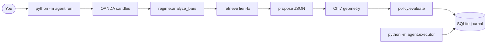

# Agent orchestrator — user manual

How to run the headless Lien analysis loop: regime → retrieve → propose →
Ch. 7 geometry → risk gate → journal, then (optionally) a stub paper fill.

This is a **research / paper-journal** workflow. It does **not** place, modify,
or close broker or MT4 orders. Evidence in the corpus is **heuristic**. Treat
output as a replayable brief, not a signal service.

Related: [Lien FX Strategies](LIEN_FX_STRATEGIES.md) (Ch. 7 governing layer),
[Agentic Trading Roadmap](AGENTIC_TRADING_ROADMAP.md) (architecture),
[Corpus Runbook](CORPUS_RUNBOOK.md) (ingest `lien-fx`).

---

## 1. What it does

`python -m agent.run` walks a **fixed graph**. The language model may fill
thesis and citations; **prices** come from Ch. 7 geometry on the indicator
snapshot. The model cannot skip the policy node or talk to a broker.



| Node | Who computes it | Skippable? |
|------|-----------------|------------|
| Candles | OANDA practice API | No (unless you inject bars in tests) |
| Regime | `app/regime.py` in code | No |
| RAG | Chroma + `nomic-embed-text` | `--no-rag` |
| Propose | Ollama chat, or skeleton | `--no-llm` |
| Geometry | `agent/levels.py` from the snapshot | No (after a proposal) |
| Policy | `agent/policy.py` + `app/risk.py` | **Never** |
| Journal | `data/journal/runs.sqlite` | `--no-journal` |
| Stub fill | separate process | only if `--mode paper` queued a fill |

If `trend_waning` is true after classification, retrieve and propose are skipped
and the action is `wait`.

---

## 2. Prerequisites

Run from the repo root with the project venv.

1. **OANDA practice** credentials in `.env` (`OANDA_API_KEY`, `OANDA_ACCOUNT_ID`,
   `OANDA_ENV=practice`). Same setup as [README](../README.md) Research MCP.
2. **Ollama** on `http://localhost:11434` if you want RAG or an LLM proposal
   (`nomic-embed-text` for retrieve; chat model from `app/config.py`, currently
   `qwen3:4b`). Not required for `--no-rag --no-llm`.
3. **Corpus** with source id `lien-fx` ingested into Chroma if you want citations.
   See [Corpus Runbook](CORPUS_RUNBOOK.md). `--no-rag` skips this.
4. **MT4 overlay** is optional: `SandboxChartBridge.mq4` on a chart whose
   **symbol and timeframe match** the run (Daily classification needs D1).
   AutoTrading can stay off.

FastAPI (`localhost:8000`) does **not** need to be running. The graph talks to
OANDA, Chroma, and Ollama directly.

---

## 3. Quick start

Regime + journal, prices from Ch. 7 snapshot (no embeddings, no chat):

```bash
.venv/bin/python -m agent.run --instrument GBP_USD --granularity D --no-rag --no-llm
```

Full analysis (needs Ollama + ingested `lien-fx`):

```bash
.venv/bin/python -m agent.run --instrument GBP_USD --granularity D
```

Paper-journal a passing setup, then simulate a fill in another process:

```bash
.venv/bin/python -m agent.run --instrument GBP_USD --mode paper
.venv/bin/python -m agent.executor --once
```

`--mode paper` still does not call OANDA order APIs. The executor writes
`filled_sim` into the journal.

---

## 4. Modes

| `--mode` | Passing policy result | Fills |
|----------|----------------------|--------|
| `signal` (default) | `log_setup` | never queued |
| `paper` | `pending_exec` (except `breakout_watch` → `log_setup`) | stub only, after `agent.executor` |

Failures always become `wait`. `breakout_watch` never becomes `pending_exec`.

---

## 5. CLI — `python -m agent.run`

| Flag | Default | Meaning |
|------|---------|---------|
| `--instrument` | `EUR_USD` | OANDA name (`GBP_USD`, not `GBPUSD`) |
| `--granularity` | `D` | Lien journal default. `H1` / `H4` allowed |
| `--count` | `250` | Candle count (covers 200-SMA). Ignored if both `--from` and `--to` are set |
| `--from` / `--to` | unset | RFC3339 window (OANDA: not from+to+count together) |
| `--mode` | `signal` | `signal` or `paper` |
| `--balance` | `10000` | Account for `position_size` |
| `--use-account` | off | Use OANDA practice NAV/balance instead of `--balance` |
| `--risk-fraction` | `0.02` | Fraction of balance risked (2%) |
| `--exposure-cap` | `0.06` | Max open + new risk fraction (v1 open risk is 0) |
| `--mt4` | off | Draw regime overlay (`sbox.regime.`) and, if policy passes, ticket hlines (`sbox.ticket.`) |
| `--mt4-prefix` | `sbox.regime.` | Regime object prefix; does not clear `sbox.formation.` or `sbox.ticket.` |
| `--no-rag` | off | Skip Chroma retrieve |
| `--no-llm` | off | Skeleton thesis; Ch. 7 geometry still fills prices |
| `--source` | `lien-fx` | Chroma metadata filter |
| `--top-k` | `5` | Retrieved chunks |
| `--journal` | `data/journal/runs.sqlite` | SQLite path |
| `--no-journal` | off | Print JSON only; do not write the DB |
| `--quiet` | off | Suppress stderr progress (stdout JSON unchanged) |

Progress (graph steps, Ollama VRAM load / still-generating pulses every 5s) goes
to **stderr**. Stdout stays the `RunRecord` JSON. A long silent pause is usually
Ollama loading `qwen3:4b` or `nomic-embed-text` onto the 6 GB card; you should
see `loading … into VRAM` then `still loading … (Ns)` until `/api/ps` shows the
model, then `generating`.

Stdout is the `RunRecord` JSON (same idea as `scripts/classify_regime.py`).
Exit code `1` if the run had an `error` **and** `action` is `wait` (fetch/classify/propose failure). A clean `wait` from the policy gate is exit `0`.

---

## 6. Reading the JSON

Look at `action` first, then `risk.reasons` if it is `wait`.

| Field | What it is |
|-------|------------|
| `run_id` | Journal primary key (hex UUID) |
| `action` | `wait` / `log_setup` / `pending_exec` |
| `regime` | Full Ch. 7 checklist (`regime`, `direction`, `trend_waning`, `allowed_play_classes`, snapshot, notes) |
| `proposal` | Thesis, play class, side, entry/stop/target, citations |
| `risk` | `ok`, planned R, `size_units`, `stop_distance`, `reasons` |
| `citations` | `{source, chunk_index, distance}` from retrieve |
| `tool_trace` | Node name + latency_ms + short detail |
| `error` | Fetch/classify/parse failure, or null |

**Do not** treat `regime.risk_reversals` or `implied_vol` as numbers; they are
`unavailable`. Do not recompute ADX / Bollinger / SMA / RSI / MACD from the
model — those values are already in `regime.snapshot`. Entry / stop / target
are filled from that snapshot by `agent/levels.py` (last close, 10-bar high/low,
optional Bollinger rail, 10-pip buffer, target at 2R). Book excerpts do not
supply current quotes.

Play classes (must match `regime.allowed_play_classes`):

| Class | Typical regime |
|-------|----------------|
| `join_trend` | trend, not waning |
| `fade_range` | range |
| `breakout_watch` | mixed, or waning (then the graph waits before proposing) |

---

## 7. Policy gate (code, not the model)

Implemented in `agent/policy.py` using `app/risk.py`. Any failure → `wait`.

1. `trend_waning` is true → wait (“do not aggress”).
2. No proposal, or `play_class` not in `allowed_play_classes`.
3. Missing `side` / entry / stop / target (`side` `none` counts as missing).
4. Long requires stop below entry; short requires stop above entry.
5. Planned R (`r_multiple(entry, stop, target)`) must be **≥ 1:2**.
6. `position_size(balance, risk_fraction, stop_distance)` must succeed.
7. `open_risk_fraction + risk_fraction` must be ≤ `--exposure-cap`.

A passing `signal` run is `log_setup`. A passing `paper` run is `pending_exec`
unless the play class is `breakout_watch`.

`--no-llm` still runs Ch. 7 geometry: `join_trend` / `fade_range` get a ticket
from the snapshot; `breakout_watch` stays `side: none` and policy waits. The
language model (when used) supplies thesis and citations, not prices.

---

## 8. Decision journal

Default path: `data/journal/runs.sqlite` (gitignored). Created on first write.

| Table | Role |
|-------|------|
| `runs` | One row per `agent.run`: action, goal/regime/proposal/risk JSON |
| `fills` | Stub executor rows: `pending` → `filled_sim` or `rejected` |

`--mode paper` plus `action=pending_exec` inserts a `fills` row with
`status=pending`. `signal` / `wait` / `log_setup` do not.

Inspect:

```bash
sqlite3 data/journal/runs.sqlite \
  "SELECT id, ts, instrument, action FROM runs ORDER BY ts DESC LIMIT 10;"

sqlite3 data/journal/runs.sqlite \
  "SELECT run_id, status, fill_price, note FROM fills ORDER BY id DESC LIMIT 10;"
```

Replay a run: the `runs` row is enough to see regime snapshot, citations, and
why policy passed or waited. That is the success criterion in the roadmap
(“replay why a trade happened”) — here “trade” means a journaled setup or stub
fill, not a broker order.

---

## 9. Stub executor — `python -m agent.executor`

Run in a **separate process**. The orchestrator never fills in-process.

```bash
.venv/bin/python -m agent.executor --once
.venv/bin/python -m agent.executor --watch --interval 5
```

| Flag | Meaning |
|------|---------|
| `--journal` | Same SQLite file as `agent.run` |
| `--once` | Drain current `pending` rows and exit (default behavior) |
| `--watch` | Loop; Ctrl-C to stop |
| `--interval` | Seconds between `--watch` scans (default 5) |

Fill price is `proposal.entry`, else `regime.last_close`. Slippage is zero. No
OANDA write. Missing both prices → `rejected`.

Stdout is a JSON list of `SimFill` objects (`run_id`, `status`, `fill_price`,
`ts`, `note`).

---

## 10. Typical sessions

**Check the governing layer only** (same numbers as `scripts/classify_regime.py`,
plus a journaled `wait`):

```bash
.venv/bin/python -m agent.run --instrument GBP_USD --granularity D --no-rag --no-llm
```

**Daily brief with book citations** (Ollama + corpus):

```bash
.venv/bin/python -m agent.run --instrument GBP_USD --granularity D --mt4
```

`--mt4` refuses if the EA heartbeat is stale or the chart is not GBPUSD D1
(or whatever instrument/TF you passed). Regime overlay is bands, MA stack,
10-bar high/low, regime label, and a color legend — not oscillator panes.
If policy passes, entry / stop / target are drawn as hlines on prefix
`sbox.ticket.` (does not clear `sbox.regime.`), with a vline/arrow at the
decision bar (`regime.last_time`). Each MT4 command waits until the EA
heartbeat `last_cmd_id` matches, so the ticket write cannot overwrite
`cmd.json` before the regime overlay is applied. MCP: `mt4_draw_ticket`
(explicit prices or journal `run_id`). Display only; no MT4 orders.
Recompile `SandboxChartBridge.mq4` after pulling so `vline` objects draw.

**Paper journal loop** (two terminals):

```bash
# terminal 1 — analysis (add --mt4 to paint entry/stop/target on a matching chart)
.venv/bin/python -m agent.run --instrument EUR_USD --mode paper --mt4

# terminal 2 — stub fills
.venv/bin/python -m agent.executor --watch
```

---

## 11. What this is not

- Not live or practice **order** placement (OANDA MCP stays read-only).
- Not Lien Ch. 8–16 entry engines (those stay in
  [LIEN_FX_STRATEGIES.md](LIEN_FX_STRATEGIES.md) tables). Tickets today are
  Ch. 7 geometry (`agent/levels.py`), not a named chapter setup.
- Not HTTP `/agent/run` (still a later wrapper around this same graph).
- Not a Cursor-only flow: Cursor via MCP is an alternate client; this CLI is
  the in-repo orchestrator.

---

## 12. Tests

No network. From repo root:

```bash
.venv/bin/python -m unittest tests.test_agent_policy tests.test_agent_graph \
  tests.test_agent_journal tests.test_agent_executor tests.test_agent_levels -v
```
