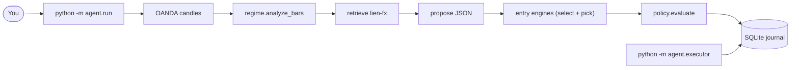

# Agent orchestrator — user manual

How to run the headless Lien analysis loop: regime → retrieve → propose →
entry engines → risk gate → journal, then (optionally) a stub paper fill.

This is a **research / paper-journal** workflow. It does **not** place, modify,
or close broker or MT4 orders. Evidence in the corpus is **heuristic**. Treat
output as a replayable brief, not a signal service.

Related: [Lien FX Strategies](LIEN_FX_STRATEGIES.md) (Ch. 7 governing layer),
[Agentic Trading Roadmap](AGENTIC_TRADING_ROADMAP.md) (architecture; §1c is the
intended LLM **planner** around this CLI, not inside it),
[Corpus Runbook](CORPUS_RUNBOOK.md) (ingest `lien-fx`).

---

## 1. What it does

`python -m agent.run` walks a **fixed graph**. The language model may fill
thesis and citations; **prices** come from a deterministic **entry engine**
selected by the regime (see §6b). The model cannot skip the policy node or talk
to a broker. `python -m agent.walk` is a separate causal paper walk over
`--from`/`--to` (warmup before `--from`, one position at a time; still Ch. 7
geometry only). `agent.run --from/--to` still snapshots the **last** bar of that
window.



| Node | Who computes it | Skippable? |
|------|-----------------|------------|
| Candles | OANDA practice API | No (unless you inject bars in tests) |
| Regime | `app/regime.py` in code | No |
| RAG | Chroma + `nomic-embed-text` | `--no-rag` |
| Propose | Ollama chat, or skeleton | `--no-llm` |
| Engines | `agent/engines/` (registry select + highest-confidence firing signal) | No (after a proposal) |
| Policy | `agent/policy.py` + `app/risk.py` | **Never** |
| Journal | `data/journal/runs.sqlite` | `--no-journal` |
| Stub fill | separate process | only if `--mode paper` queued a fill |

If `trend_waning` is true after classification, retrieve and propose are skipped
and the action is `wait`.

---

## 2. Prerequisites

Run from the repo root with the project venv.

1. **OANDA practice** credentials in `.env` (`OANDA_API_KEY`, `OANDA_ACCOUNT_ID`,
   `OANDA_ENV=practice`). Same setup as [README](../README.md) Research MCP.
2. **Ollama** on `http://localhost:11434` if you want RAG or an LLM proposal
   (`nomic-embed-text` for retrieve; chat model from `app/config.py`, currently
   `qwen3:4b`). Not required for `--no-rag --no-llm`.
3. **Corpus** with source id `lien-fx` ingested into Chroma if you want citations.
   See [Corpus Runbook](CORPUS_RUNBOOK.md). `--no-rag` skips this.
4. **MT4 overlay** is optional: attach `SandboxChartBridge.mq4` to **each
   chart** you care about (same symbol and timeframe as that chart; Daily
   classification needs D1). Python still issues **one overlay at a time**
   (`GBP_USD` + `D` writes `sandbox002/GBPUSD_D1/`). Other charts keep their
   objects and keep heartbeating. AutoTrading can stay off. Wipe leftover
   objects with `python -m agent.mt4_clear --instrument GBP_USD --granularity D`
   (default prefix `sbox.`). Recompile the EA after pulling (**v1.04**) so
   each chart uses its own inbox and hidden objects are deleted, not only
   deselected.

FastAPI (`localhost:8000`) does **not** need to be running. The graph talks to
OANDA, Chroma, and Ollama directly.

---

## 3. Quick start

Regime + journal, prices from Ch. 7 snapshot (no embeddings, no chat):

```bash
.venv/bin/python -m agent.run --instrument GBP_USD --granularity D --no-rag --no-llm
```

Full analysis (needs Ollama + ingested `lien-fx`):

```bash
.venv/bin/python -m agent.run --instrument GBP_USD --granularity D
```

Paper-journal a passing setup, then simulate a fill in another process:

```bash
.venv/bin/python -m agent.run --instrument GBP_USD --mode paper
.venv/bin/python -m agent.executor --once
```

`--mode paper` still does not call OANDA order APIs. The executor writes
`filled_sim` into the journal.

---

## 4. Modes

| `--mode` | Passing policy result | Fills |
|----------|----------------------|--------|
| `signal` (default) | `log_setup` | never queued |
| `paper` | `pending_exec` (except `breakout_watch` → `log_setup`) | stub only, after `agent.executor` |

Failures always become `wait`. `breakout_watch` never becomes `pending_exec`.

---

## 5. CLI — `python -m agent.run`

| Flag | Default | Meaning |
|------|---------|---------|
| `--instrument` | `EUR_USD` | OANDA name (`GBP_USD`, not `GBPUSD`) |
| `--granularity` | `D` | Lien journal default (higher timeframe). `H1` / `H4` allowed |
| `--ltf-granularity` | `H1` | Lower timeframe for multi-TF engines (Ch. 8 MTF, Ch. 13 Fader) |
| `--engines` | unset | Comma-separated chapter allow-list (e.g. `8,7`). Default: all matching |
| `--count` | `250` | Candle count (covers 200-SMA). Ignored if both `--from` and `--to` are set |
| `--from` / `--to` | unset | RFC3339 window (OANDA: not from+to+count together). Snapshot at the **last** bar. |
| `--mode` | `signal` | `signal` or `paper` |
| `--balance` | `10000` | Account for `position_size` |
| `--use-account` | off | Use OANDA practice NAV/balance instead of `--balance` |
| `--risk-fraction` | `0.02` | Fraction of balance risked (2%) |
| `--exposure-cap` | `0.06` | Max open + new risk fraction (v1 open risk is 0) |
| `--mt4` | off | Draw regime overlay (`sbox.regime.`) and, if policy passes, ticket hlines (`sbox.ticket.`) |
| `--mt4-prefix` | `sbox.regime.` | Regime object prefix; does not clear `sbox.formation.` or `sbox.ticket.` |
| `--no-rag` | off | Skip Chroma retrieve |
| `--no-llm` | off | Skeleton thesis; Ch. 7 geometry still fills prices |
| `--source` | `lien-fx` | Chroma metadata filter |
| `--top-k` | `5` | Retrieved chunks |
| `--journal` | `data/journal/runs.sqlite` | SQLite path |
| `--no-journal` | off | Print JSON only; do not write the DB |
| `--quiet` | off | Suppress stderr progress (stdout JSON unchanged) |

Progress (graph steps, Ollama VRAM load / still-generating pulses every 5s) goes
to **stderr**. Stdout stays the `RunRecord` JSON. A long silent pause is usually
Ollama loading `qwen3:4b` or `nomic-embed-text` onto the 6 GB card; you should
see `loading … into VRAM` then `still loading … (Ns)` until `/api/ps` shows the
model, then `generating`.

Stdout is the `RunRecord` JSON (same idea as `scripts/classify_regime.py`).
Exit code `1` if the run had an `error` **and** `action` is `wait` (fetch/classify/propose failure). A clean `wait` from the policy gate is exit `0`.

---

## 6. Reading the JSON

Look at `action` first, then `risk.reasons` if it is `wait`.

| Field | What it is |
|-------|------------|
| `run_id` | Journal primary key (hex UUID) |
| `action` | `wait` / `log_setup` / `pending_exec` |
| `regime` | Full Ch. 7 checklist (`regime`, `direction`, `trend_waning`, `allowed_play_classes`, snapshot, notes) |
| `proposal` | Thesis, play class, side, entry/stop/target, **`at_time`** (decision bar), **`engine`/`chapter`** (chosen entry engine), citations |
| `risk` | `ok`, planned R, `size_units`, `stop_distance`, `reasons` |
| `citations` | `{source, chunk_index, distance}` from retrieve |
| `tool_trace` | Node name + latency_ms + short detail |
| `error` | Fetch/classify/parse failure, or null |

**Do not** treat `regime.risk_reversals` or `implied_vol` as numbers; they are
`unavailable`. Do not recompute ADX / Bollinger / SMA / RSI / MACD from the
model — those values are already in `regime.snapshot`. Entry / stop / target
are filled from that snapshot by `agent/levels.py` (last close, 10-bar high/low,
optional Bollinger rail, 10-pip buffer, target at 2R). Book excerpts do not
supply current quotes.

Play classes (must match `regime.allowed_play_classes`):

| Class | Typical regime |
|-------|----------------|
| `join_trend` | trend, not waning |
| `fade_range` | range |
| `breakout_watch` | mixed, or waning (then the graph waits before proposing) |

---

## 6b. Entry engines

After a proposal (LLM or skeleton), the graph selects **entry engines** by
regime and picks the highest-confidence *firing* signal. Engines are
deterministic, never recompute indicators, and only run when not `trend_waning`.
The chosen engine overwrites the proposal's `play_class`, `side`, and
`entry/stop/target`; the model keeps only thesis and citations.

| Engine | Chapter | Fires for | Timeframes | Confidence |
|--------|---------|-----------|------------|------------|
| `mtf` (`agent/engines/mtf.py`) | 8 | `join_trend` | `--granularity` + `--ltf-granularity` | `0.5*htf_regime_conf + 0.5*rsi_extremity` |
| `dbb` (`agent/engines/dbb.py`) | 9 | `join_trend`, `fade_range` | `--granularity` | `0.5*regime_conf + 0.5*band_extremity` |
| `fader` (`agent/engines/fader.py`) | 13 | `fade_range` | `--granularity` + `--ltf-granularity` | `0.5*regime_conf + 0.5*probe_excess` |
| `breakout20` (`agent/engines/breakout20.py`) | 14 | `join_trend` | `--granularity` | `0.5*regime_conf + 0.5*clearance` |
| `perfect_order` (`agent/engines/perfect_order.py`) | 16 | `join_trend` | `--granularity` | `0.5*regime_conf + 0.5*ADX_strength` |
| `ch7_geometry` (`agent/engines/ch7.py`) | 7 | `join_trend`, `fade_range` | `--granularity` | `0.5*regime_conf` (fallback discount) |

- Selection (`agent/engines/registry.py`): engines whose `play_classes` match
  `allowed_play_classes`, filtered by `--engines` when set. Ch. 7 is the generic
  fallback, so a firing specialized engine (Ch. 8+) outranks it by confidence;
  ties break by registry priority.
- Multi-TF fetch: Ch. 8 (`mtf`) and Ch. 13 (`fader`) need the lower timeframe
  too. In live mode the graph fetches + classifies it; with injected bars (tests)
  it is only fetched when a `fetch_analyses_fn` is provided, so injected-bars
  runs stay offline (those engines simply do not fire).
- If no engine matches the regime (e.g. `breakout_watch`), the graph falls back
  to Ch. 7 geometry directly (`side: none`, policy waits) — prior behavior.
- The chosen engine is recorded on `proposal.engine` / `proposal.chapter` and in
  the `engines` tool trace.

The standalone tools/CLIs (`entry_mtf`, `entry_dbb`, `entry_lien`,
`scripts/entry_mtf.py`, `scripts/entry_lien.py`) still exist for a direct
signal outside the graph. Causal walks: `python -m agent.walk_mtf` (Ch. 8),
`python -m agent.walk_lien --chapter 9|13|14|16`.

---

## 7. Policy gate (code, not the model)

Implemented in `agent/policy.py` using `app/risk.py`. Any failure → `wait`.

1. `trend_waning` is true → wait (“do not aggress”).
2. No proposal, or `play_class` not in `allowed_play_classes`.
3. Missing `side` / entry / stop / target (`side` `none` counts as missing).
4. Long requires stop below entry; short requires stop above entry.
5. Planned R (`r_multiple(entry, stop, target)`) must be **≥ 1:2**.
6. `position_size(balance, risk_fraction, stop_distance)` must succeed.
7. `open_risk_fraction + risk_fraction` must be ≤ `--exposure-cap`.

A passing `signal` run is `log_setup`. A passing `paper` run is `pending_exec`
unless the play class is `breakout_watch`.

`--no-llm` still runs Ch. 7 geometry: `join_trend` / `fade_range` get a ticket
from the snapshot; `breakout_watch` stays `side: none` and policy waits. The
language model (when used) supplies thesis and citations, not prices.

---

## 8. Decision journal

Default path: `data/journal/runs.sqlite` (gitignored). Created on first write.

| Table | Role |
|-------|------|
| `runs` | One row per `agent.run`: action, goal/regime/proposal/risk JSON |
| `fills` | Stub executor rows: `pending` → `filled_sim` or `rejected` |

`--mode paper` plus `action=pending_exec` inserts a `fills` row with
`status=pending`. `signal` / `wait` / `log_setup` do not. Causal
`python -m agent.walk` writes `filled_sim` immediately (never `pending`)
and later sets `exit_status` / `exit_price` / `r_realized`.

Inspect:

```bash
sqlite3 data/journal/runs.sqlite \
  "SELECT id, ts, instrument, action FROM runs ORDER BY ts DESC LIMIT 10;"

sqlite3 data/journal/runs.sqlite \
  "SELECT run_id, status, fill_price, note FROM fills ORDER BY id DESC LIMIT 10;"
```

Replay a run: the `runs` row is enough to see regime snapshot, citations, and
why policy passed or waited. That is the success criterion in the roadmap
(“replay why a trade happened”) — here “trade” means a journaled setup or stub
fill, not a broker order.

---

## 9. Stub executor — `python -m agent.executor`

Run in a **separate process** from `agent.run`. The snapshot orchestrator
never fills in-process. (`agent.walk` records its own `filled_sim` + exit.)

```bash
.venv/bin/python -m agent.executor --once
.venv/bin/python -m agent.executor --watch --interval 5
```

| Flag | Meaning |
|------|---------|
| `--journal` | Same SQLite file as `agent.run` |
| `--once` | Drain current `pending` rows and exit (default behavior) |
| `--watch` | Loop; Ctrl-C to stop |
| `--interval` | Seconds between `--watch` scans (default 5) |

Fill price is `proposal.entry`, else `regime.last_close`. Slippage is zero. No
OANDA write. Missing both prices → `rejected`.

Stdout is a JSON list of `SimFill` objects (`run_id`, `status`, `fill_price`,
`ts`, `note`).

---

## 9b. Causal paper walk — `python -m agent.walk`

Same warmup + `[--from, --to]` fetch as `scripts/walk_regime.py`. Each decision
uses only `bars[:i+1][-lookback:]` (no look-forward). No RAG / LLM.

1. While **flat**, run skeleton + Ch. 7 geometry + policy (`mode=paper`).
2. First `pending_exec` **fills at that bar’s close** (`--fill close`, default).
   **Every** fill is journaled (one `runs` row per trade, not only the last).
   `ts` and `proposal.at_time` are that decision bar, not wall-clock now.
3. Hold **one** position. From the **next** bar, record stop or target (if both
   trade in one bar, **stop wins**). Gaps through the stop still exit at the stop.
4. Still open at `--to` → `window_end` at last close. Then flatten.
5. Next fill only after flat.

`--fill rest` is an opt-in simulator closer to a v20 market order on historical
OANDA candles (not broker P&L, not the MT4 tester in §9e, not `POST /orders`):

| `--fill` | Signal | Fill | Exit | Equity |
|----------|--------|------|------|--------|
| `close` (default) | Mid close of bar `i` | That close | Next bar mid H/L; gap still at the stop | `pnl = equity * risk_fraction * R` |
| `rest` | Mid close of bar `i` (ticket stop/target unchanged) | Bar `i+1` taking-side open (long **ask** / short **bid**). No next bar → drop. Fill on the wrong side of the stop → skip | Making side from the fill bar (long **bid**, short **ask**). Making-side **open** already through the stop → exit at that **open**. Stop still wins if both trade | `units = floor(position_size(...))`; `pnl = units * Δprice * value_per_price_unit`; still record `r_realized` |

USD-quoted pairs in a USD account can leave `--value-per-price-unit` at `1.0`.
Pairs like `USD_JPY` need that flag set; this pass does not auto-fetch OANDA
conversion. Missing bid/ask in rest mode is a `WalkError` (no silent mid fallback).

```bash
.venv/bin/python -m agent.walk \
  --instrument GBP_USD --granularity D --fill rest \
  --from 2024-01-01T00:00:00Z --to 2024-06-01T00:00:00Z
```

`--mt4` paints walk ranges (`sbox.regime.walk.`) plus, for **every** sequential
fill, direction (arrow + `long`/`short` text), time-bounded stop (red dash) and
take-profit (green dash) on `sbox.ticket.walk.`. Not chart-wide hlines. Every
fill is a journal row; the list shows side / stop / target / R / simulated pnl
and equity; detail includes the fill exit (`stop` / `target` / `window_end`).

Simulated equity compounds per fill. Default `--fill close`:
`pnl = equity * risk_fraction * R`, then `equity += pnl` (default 2% of current
equity). `--fill rest` compounds cash P&L from integer units instead (R is still
recorded). Each walk has a `walk_id`. The CLI JSON and
`GET /api/journal/walks/{walk_id}` report n, win rate, sum/mean R, ending equity,
and max drawdown. This is not broker P&L.

```bash
.venv/bin/python -m agent.walk \
  --instrument GBP_USD --granularity D \
  --from 2024-01-01T00:00:00Z --to 2024-06-01T00:00:00Z --mt4
```

Decisions are causal; **outcomes** use later bars by design. Do not use
`agent.executor` on these rows (they are already `filled_sim`).

---

## 9c. Causal MTF paper walk — `python -m agent.walk_mtf`

Ch. 8 rollover-peak back-test on the **lower TF** (default **H1**), with Ch. 7
regime on the **higher TF** (default **D**). Same warmup + `[--from, --to]`
fetch as §9b, but two series via `app/walk_fetch.fetch_walk_bars`. Each LTF
step uses causal HTF/LTF windows only (`htf[:htf_idx+1][-lookback:]`,
`ltf[:i+1][-lookback:]` where `htf_idx` is the last HTF bar with
`time <= ltf[i].time`).

While **flat**:

1. Run `mtf_signal` + `signal_confidence` (`agent/engines/mtf.py`).
2. Track the running max confidence among **firing** signals.
3. When confidence **strictly drops** (including a non-fire at `0`), the prior
   bar was the peak. Since a peak is only knowable once a lower bar follows it,
   enter at the **rollover bar** (where the drop is observed) — never backdated
   to the peak bar — with the ticket **recomputed from the rollover bar's
   geometry** (last close entry, 10-bar high/low ± buffer stop, 2R target). This
   keeps the walk causal (no look-ahead). Confidence recorded is the peak's.
4. If a peak never rolls over before `--to`, it is **not** entered (no causal
   confirmation).

While **in trade**: manage stop / target on subsequent LTF bars (stop wins if
both trade). Still open at `--to` → `window_end`. After flat, reset peak
tracking and resume hunting (multiple entries per walk allowed).

```bash
.venv/bin/python -m agent.walk_mtf \
  --instrument GBP_USD --granularity D --ltf-granularity H1 \
  --from 2024-01-01T00:00:00Z --to 2024-06-01T00:00:00Z
```

Stdout JSON: `walk_id`, `trades`, compounded `equity` (same `--fill` modes as
§9b). Dual-TF rest fetch is **HTF mid only** (regime) and **LTF MBA** (execution).
Journal rows use `proposal.engine=mtf` and peak confidence on the proposal.
Research only; no broker orders.

---

## 9d. Causal Lien walks — `python -m agent.walk_lien`

Ch. 9 / 14 / 16 are **one-shot events** on the primary TF (`agent.event_walk`).
Ch. 13 Fader steps the **lower TF** against a daily ADX gate (`agent.fader_walk`),
first-fire like MTF `--entry-mode first_fire`. Same warmup + `[--from, --to]`
fetch as §9b. `--fill close|rest` matches §9b; Ch.13 rest uses LTF bid/ask only.

```bash
.venv/bin/python -m agent.walk_lien --chapter 16 --instrument USD_JPY \
  --from 2024-01-01T00:00:00Z --to 2024-06-01T00:00:00Z
.venv/bin/python -m agent.walk_lien --chapter 13 --instrument EUR_USD \
  --granularity D --ltf-granularity H1 \
  --from 2024-01-01T00:00:00Z --to 2024-06-01T00:00:00Z
```

`--chapter 9` is the same Ch. 9 event feed as `agent.tester_backtest --engine dbb`.

---

## 9e. MT4 Strategy Tester back-test — `python -m agent.tester_backtest`

Runs encoded engines **inside the MT4 Strategy Tester** so MT4's native report
(equity curve, profit factor, drawdown) is the output. Two passes, file-based.
`--engine mtf|dbb|fader|breakout20|perfect_order` or `--chapter 8|9|13|14|16`.
Full workflow: [MT4_TESTER_BACKTEST.md](MT4_TESTER_BACKTEST.md).

1. **Export pass** — `SandboxTesterBridge.mq4` with `InpMode=export` writes every
   completed bar to `tester/files/sandbox002/<SYMBOL>_<TF>/bars.csv`.
2. **Compute** — `python -m agent.tester_backtest` reads `bars.csv` and writes
   `decisions.csv`. MTF/Fader resample an HTF; dbb/breakout20/perfect_order run
   on the exported TF. Tester owns position state.
3. **Replay pass** — `SandboxTesterBridge.mq4` with `InpMode=replay` loads
   `decisions.csv` and `OrderSend`s each entry at the open of the bar after its
   `signal_time` (the rollover bar), SL/TP from the ticket; the tester manages
   exits natively.

`mtf_decisions` shares the `_PeakTracker` with `walk_mtf`, so decisions match the
paper walk's confirmation logic. Orders exist only inside the tester (the EA
refuses to run outside it via `IsTesting()`); the live bridge stays order-free.
Walk `--fill rest` is a different venue (OANDA REST candles, no `OrderSend`).

---

## 10. Typical sessions

**Check the governing layer only** (same numbers as `scripts/classify_regime.py`,
plus a journaled `wait`):

```bash
.venv/bin/python -m agent.run --instrument GBP_USD --granularity D --no-rag --no-llm
```

**Daily brief with book citations** (Ollama + corpus):

```bash
.venv/bin/python -m agent.run --instrument GBP_USD --granularity D --mt4
```

`--mt4` refuses if that chart's EA heartbeat is stale or the chart is not
GBPUSD D1 (or whatever instrument/TF you passed). Run one pair at a time;
leave the EA attached on other charts. Regime overlay is bands, MA stack,
10-bar high/low, regime label, and a color legend — not oscillator panes.
If policy passes, entry / stop / target are drawn as hlines on prefix
`sbox.ticket.` (does not clear `sbox.regime.`), with a vline/arrow at the
decision bar (`regime.last_time`). Each MT4 command waits until **that
chart's** heartbeat `last_cmd_id` matches, so the ticket write cannot
overwrite `sandbox002/GBPUSD_D1/cmd.json` before the regime overlay is
accepted. The EA heartbeats that id before drawing (a full overlay can take
longer than the wait). MCP: `mt4_draw_ticket` (explicit prices or journal
`run_id`). Display only; no MT4 orders. `cmd.json` is compact; the EA reads
it as FILE_BIN chunks so `t1` timestamps are not split. Recompile
`SandboxChartBridge.mq4` after pulling (v1.04: per-chart inbox; acks before
drawing; init does not replay leftover `cmd.json`).

**Paper journal loop** (two terminals):

```bash
# terminal 1 — analysis (add --mt4 to paint entry/stop/target on a matching chart)
.venv/bin/python -m agent.run --instrument EUR_USD --mode paper --mt4

# terminal 2 — stub fills
.venv/bin/python -m agent.executor --watch
```

---

## 11. What this is not

- Not live or practice **order** placement (OANDA MCP stays read-only).
- Encoded entry engines: Ch. 8 (`mtf`), 9 (`dbb`), 13 (`fader`), 14
  (`breakout20`), 16 (`perfect_order`), plus Ch. 7 geometry fallback. Ch. 10,
  11, 12, and 15 remain documented only in
  [LIEN_FX_STRATEGIES.md](LIEN_FX_STRATEGIES.md). When no specialized engine
  fires, tickets fall back to Ch. 7 geometry (`agent/levels.py`).
- Not HTTP `/agent/run` (still a later wrapper around this same graph).
- Not a Cursor-only flow: Cursor via MCP is an alternate client; this CLI is
  the in-repo orchestrator.

---

## 12. Tests

No network. From repo root:

```bash
.venv/bin/python -m unittest tests.test_agent_policy tests.test_agent_graph \
  tests.test_agent_journal tests.test_agent_executor tests.test_agent_levels \
  tests.test_agent_paper_walk tests.test_agent_walk_exec tests.test_agent_mtf_walk \
  tests.test_mt4_tester tests.test_agent_mt4_clear tests.test_agent_dbb_walk \
  tests.test_agent_event_walk tests.test_agent_fader_walk tests.test_walk_fetch \
  tests.test_lien_geometry tests.test_lien_chapters \
  tests.test_engines_registry tests.test_engines_ch7 tests.test_entry_mtf \
  tests.test_entry_dbb tests.test_entry_fader tests.test_entry_breakout20 \
  tests.test_entry_perfect_order -v
```
