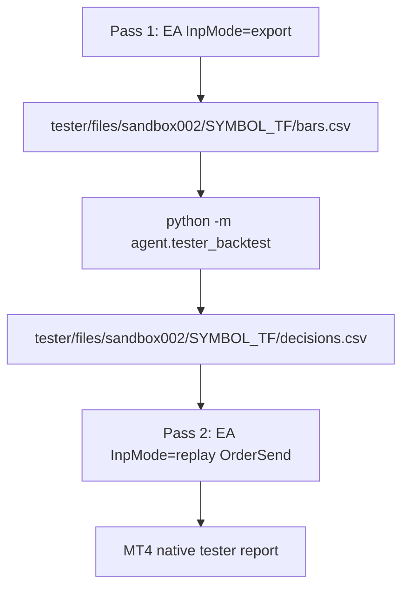

# MT4 Strategy Tester back-test

Run the Ch. 8 rollover-peak entry engine **inside the MetaTrader 4 Strategy
Tester** so MT4's native report (equity curve, profit factor, drawdown, trade
list) is the output, instead of the Python paper-walk simulation
([AGENT_ORCHESTRATOR.md](AGENT_ORCHESTRATOR.md) §9c).

Research only. Orders exist **only** inside the tester (fully simulated); the
EA refuses to run on a live/practice chart.

---

## Why two passes (tester constraints)

The Strategy Tester cannot do a live request/response loop with an external
process, so the design is file-based and offline. From the MQL4 docs:

- `Sleep()` **does not pause** execution in the tester — an EA cannot wait for
  Python within a bar.
- A test run is a **burst**: simulated time advances tick-by-tick with no
  wall-clock pause, so Python cannot interject per bar in real time.
- File I/O is sandboxed to `tester/files/` (this install is portable, so that is
  `.../OANDA - MetaTrader 4/tester/files/`).
- `TimeCurrent()` / `TimeGMT()` are equal and driven by **simulated bar time** —
  a reliable "tester timestamp" clock, which is what keys the feed.

So Python computes all decisions **up front** from the tester's own exported
bars, and the EA replays them by timestamp.



---

## Components

| Piece | Path |
|-------|------|
| Tester EA | `MQL4/Experts/Custom/SandboxTesterBridge.mq4` |
| Feed IO / resample | [app/mt4_tester.py](../app/mt4_tester.py) |
| Decision compute CLI | [agent/tester_backtest.py](../agent/tester_backtest.py) |
| Rollover-peak engine | [agent/mtf_walk.py](../agent/mtf_walk.py) (`mtf_decisions`) |
| Config (tester dir) | [app/config.py](../app/config.py) (`mt4_tester_files_dir`) |

Feed files live at `tester/files/sandbox002/<SYMBOL>_<TF>/{bars,decisions}.csv`
(e.g. `GBPUSD_H1`). Times on the wire are broker unix seconds (the tester
clock); Python converts to/from RFC3339 for the engines.

- `bars.csv`: `time,open,high,low,close,volume` (one completed bar per row).
- `decisions.csv`: `signal_time,side,entry,stop,target`, sorted ascending.

---

## Entry / exit model

- Decisions are made on a signal bar's **close** (rollover-peak: confidence rises
  then strictly drops; the peak bar is confirmed, not the rollover bar — same
  logic as `agent.walk_mtf`).
- The EA opens the trade at the **open of the next bar** after `signal_time`
  (nearest realistic tester fill), passing the ticket SL/TP straight into
  `OrderSend`. The tester handles exits natively at SL/TP.
- **One position at a time**, isolated by `InpMagic`. Python emits *every*
  confirmed peak; the EA skips any whose bar arrives while a position is open, so
  the tester is the source of truth for position state.
- Lots are sized in the EA from `InpRisk` and the SL distance against
  `AccountBalance()` (`MODE_TICKVALUE` / `MODE_TICKSIZE` / `MODE_LOTSTEP`).
- HTF regime is derived by **resampling** the exported LTF bars (H1→D by UTC
  calendar day), so signals stay on the exact tester data. Daily buckets are
  UTC-anchored and will not match OANDA's native D1 close; this is internal to
  the pipeline and deterministic.

Because both timeframes use the same `--lookback` (default 250), the tester date
range must start **well before** the first intended entry so the engines have
warmup — e.g. an H1 test needs ~250 daily buckets (~1 year) for the HTF regime.
Lower `--lookback` for shorter ranges.

---

## Run sequence (MetaEditor + Strategy Tester GUI)

1. **Compile** `SandboxTesterBridge.mq4` in MetaEditor (F7).
2. **Export pass** — Strategy Tester:
   - Expert: `SandboxTesterBridge`, Symbol `GBPUSD`, Period `H1`.
   - Date range: include warmup before your intended start.
   - Model: **Open prices only** (fast; only completed OHLC is needed).
   - Inputs: `InpMode = export`.
   - Start. Produces `tester/files/sandbox002/GBPUSD_H1/bars.csv`.
3. **Compute** the decision feed:

```bash
.venv/bin/python -m agent.tester_backtest --instrument GBP_USD --tf H1 --htf D
```

   Prints a JSON summary (bar counts, decision count, first/last signal). Writes
   `decisions.csv` next to `bars.csv`.
4. **Replay pass** — Strategy Tester, same Expert / Symbol / Period / range:
   - Model: **Every tick** (realistic intrabar SL/TP fills).
   - Inputs: `InpMode = replay`, set `InpRisk` / `InpMagic` / `InpSlippage`.
   - Start. Read the native report (Results / Graph / Report tabs).

---

## EA inputs

| Input | Default | Meaning |
|-------|---------|---------|
| `InpMode` | `export` | `export` writes bars; `replay` sends orders |
| `InpSubdir` | `sandbox002` | Feed subfolder under `tester/files` |
| `InpRisk` | `0.02` | Risk fraction per trade (replay sizing) |
| `InpMagic` | `20260826` | Order magic (one-position gate) |
| `InpSlippage` | `5` | Max slippage points on `OrderSend` |

---

## Tests

No network, no MT4:

```bash
.venv/bin/python -m unittest tests.test_mt4_tester tests.test_agent_mtf_walk -v
```

---

## Not covered

- Headless/automated tester launch (`terminal.exe /config` ini) — GUI runs only.
- Scale-out / breakeven / trailing (fixed SL/TP per trade).
- The live `cmd.json` object bridge is unrelated to this CSV feed channel.
