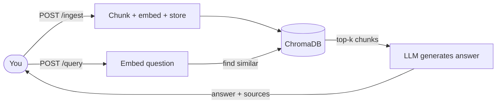

# RAG Server - User Interaction Manual

This manual explains how to interact with the local RAG (Retrieval-Augmented
Generation) server: how to feed it documents, ask questions, and interpret the
answers it returns.

- Base URL: `http://localhost:8000`
- Interactive API explorer: `http://localhost:8000/docs`
- All request and response bodies are JSON (file upload uses multipart form data).

---

## 1. Concepts

The server answers questions using **only** the documents you give it. The flow
has two phases:

1. **Ingestion** - you submit text or files. The server splits them into chunks,
   converts each chunk into an embedding (a numeric vector), and stores them in a
   vector database (ChromaDB).
2. **Querying** - you ask a question. The server embeds your question, finds the
   most similar stored chunks, and asks the language model to answer using those
   chunks as context. The answer comes back with the source chunks it used.



Key idea: if you have not ingested anything relevant, the server will say it does
not know. It does not answer from general knowledge.

---

## 2. Quick Start

Make sure the server is running:

```bash
bash scripts/start.sh
```

Check it is healthy:

```bash
curl http://localhost:8000/health
```

Add a document, then ask about it:

```bash
# 1. Ingest
curl -X POST http://localhost:8000/ingest \
  -H "Content-Type: application/json" \
  -d '{"text": "Our office is open Monday to Friday, 9am to 5pm.", "source": "hours"}'

# 2. Query
curl -X POST http://localhost:8000/query \
  -H "Content-Type: application/json" \
  -d '{"question": "When is the office open?"}'
```

---

## 3. Endpoints

### 3.1 `GET /health` - check status

Returns whether the server, Ollama, and the vector store are ready, plus how many
chunks are currently stored.

```bash
curl http://localhost:8000/health
```

Response:

```json
{
  "status": "ok",
  "ollama": true,
  "chroma": true,
  "llm_model": "llama3.2:3b",
  "embed_model": "nomic-embed-text",
  "document_chunks": 1
}
```

| Field | Meaning |
|-------|---------|
| `status` | `ok` when Ollama is reachable, otherwise `degraded` |
| `ollama` | Whether the model server responded |
| `chroma` | Whether the vector store is available |
| `llm_model` | Model used to generate answers |
| `embed_model` | Model used to create embeddings |
| `document_chunks` | Total chunks currently stored and searchable |

Use this first whenever a query fails - if `ollama` is `false`, the model server
is down (see Troubleshooting).

---

### 3.2 `POST /ingest` - add raw text

Send text directly in the request body.

Request fields:

| Field | Type | Required | Default | Description |
|-------|------|----------|---------|-------------|
| `text` | string | yes | - | The content to store |
| `source` | string | no | `"inline"` | A label identifying where the text came from |

```bash
curl -X POST http://localhost:8000/ingest \
  -H "Content-Type: application/json" \
  -d '{
        "text": "The Q3 revenue was 1.2 million dollars, up 15% year over year.",
        "source": "q3-report"
      }'
```

Response:

```json
{ "source": "q3-report", "chunks_added": 1 }
```

`chunks_added` tells you how many chunks the text was split into. Large documents
produce several chunks.

Tips:
- Give each document a distinct, meaningful `source` (for example `q3-report`,
  `employee-handbook`). It is returned with answers so you can trace citations.
- Re-ingesting with the **same** `source` overwrites the previous chunks for that
  source (they share the same chunk IDs), so you can update a document by sending
  it again.

---

### 3.3 `POST /ingest/file` - upload a file

Upload a `.txt`, `.md`, `.pdf`, or `.epub` file. This uses multipart form data, not JSON.

Form fields:

| Field | Type | Required | Description |
|-------|------|----------|-------------|
| `file` | file | yes | The document to upload |
| `source` | text | no | Label for the document; defaults to the filename |

```bash
curl -X POST http://localhost:8000/ingest/file \
  -F "file=@/path/to/handbook.pdf" \
  -F "source=employee-handbook"
```

Response:

```json
{ "source": "employee-handbook", "chunks_added": 42, "figures_added": 0 }
```

Notes:
- PDFs with an embedded text layer are extracted directly. Image-only (scanned) pages
  are OCR'd automatically via Tesseract when `PDF_OCR_ENABLED=true` (requires
  `sudo apt install tesseract-ocr`). Large scanned books can take a long time to
  ingest.
- Chart-heavy PDFs: embedded images are extracted; scanned pages with little OCR text
  are rendered and captioned with a vision model (`ollama pull moondream`). Figure
  descriptions are stored in ChromaDB alongside text chunks. Re-ingest skips figures
  already stored (same figure ID).
- EPUB files have their chapter HTML converted to plain text in spine order.
- Non-UTF-8 text files are read with a best-effort fallback encoding.

---

### 3.4 `POST /query` - ask a question

Request fields:

| Field | Type | Required | Default | Description |
|-------|------|----------|---------|-------------|
| `question` | string | yes | - | Your question |
| `top_k` | integer | no | `5` | How many chunks to retrieve as context |

```bash
curl -X POST http://localhost:8000/query \
  -H "Content-Type: application/json" \
  -d '{ "question": "What was Q3 revenue?", "top_k": 5 }'
```

Response:

```json
{
  "answer": "Q3 revenue was 1.2 million dollars, a 15% increase year over year.",
  "sources": [
    {
      "source": "q3-report",
      "chunk_index": 0,
      "distance": 0.21,
      "preview": "The Q3 revenue was 1.2 million dollars, up 15% year over year."
    }
  ]
}
```

| Field | Meaning |
|-------|---------|
| `answer` | The generated answer, grounded in the retrieved chunks |
| `sources` | The chunks used, so you can verify the answer |
| `sources[].source` | Which document the chunk came from |
| `sources[].chunk_index` | Position of the chunk within that document |
| `sources[].distance` | Similarity score; **lower means more relevant** (cosine distance) |
| `sources[].preview` | First ~200 characters of the chunk |
| `sources[].chunk_type` | `"text"` or `"figure"` when available |
| `sources[].page` | PDF page number for figure chunks |
| `sources[].image_path` | Path to stored figure PNG for figure chunks |

If nothing has been ingested, you will get:

```json
{ "answer": "No documents have been ingested yet, so I can't answer that.", "sources": [] }
```

---

## 4. Tuning `top_k`

`top_k` controls how many chunks are fed to the model as context.

- **Lower (1-3):** faster, more focused; good for specific fact lookups.
- **Higher (6-10):** broader context; good for questions that span multiple parts
  of a document, but slower and may dilute the answer.

The default is `5`. Start there and adjust per question.

---

## 5. Writing Good Questions

- Be specific. "What is the refund window for damaged items?" beats "refunds?".
- Use vocabulary similar to your documents - retrieval is based on semantic
  similarity to what was ingested.
- One question at a time gives the cleanest answers. Split multi-part questions.
- If an answer seems wrong, check the `sources`. Often the right chunk was not
  retrieved, which means either it was not ingested or `top_k` is too low.

---

## 6. Typical Workflows

### Build a knowledge base from a folder

```bash
for f in ~/docs/*.pdf; do
  curl -s -X POST http://localhost:8000/ingest/file \
    -F "file=@$f" -F "source=$(basename "$f")" >/dev/null
  echo "ingested $f"
done
```

### Ask several questions in a loop

```bash
for q in "What is the return policy?" "How long is the warranty?"; do
  echo "Q: $q"
  curl -s -X POST http://localhost:8000/query \
    -H "Content-Type: application/json" \
    -d "{\"question\": \"$q\"}" | python3 -m json.tool
  echo
done
```

### Use from Python

```python
import httpx

base = "http://localhost:8000"

httpx.post(f"{base}/ingest", json={
    "text": "The warranty lasts 24 months from purchase.",
    "source": "warranty",
})

r = httpx.post(f"{base}/query", json={"question": "How long is the warranty?"})
data = r.json()
print(data["answer"])
for s in data["sources"]:
    print(f"  - {s['source']} (distance {s['distance']:.3f})")
```

---

## 7. Errors You May See

| Status | Meaning | What to do |
|--------|---------|------------|
| `400` | Bad input (for example, unreadable PDF or OCR disabled on a scan) | Check the file; install `tesseract-ocr` for scanned PDFs |
| `422` | Validation error (missing `text` or `question`) | Fix the request body to match the schema |
| `502` | The model server (Ollama) returned an error | Check `GET /health`; restart with `scripts/start.sh` |
| `500` + timeout | Request exceeded the time budget | Usually a cold model load; retry once the model is warm |

---

## 8. Performance Notes

- **First query after startup is slow.** Models load into GPU memory on first use
  (can take over a minute). Subsequent queries are fast (about 1-2 seconds for a
  short answer).
- Models stay in GPU memory for a few minutes of inactivity, then unload. The next
  query reloads them (slow again). To keep them resident, set
  `OLLAMA_KEEP_ALIVE=-1` in the environment where Ollama runs.
- The request timeout is 300 seconds, sized to tolerate cold loads.

---

## 9. Limitations

- Answers are limited to what you ingest; the server will not use outside
  knowledge.
- There is no built-in document deletion or listing endpoint yet - re-ingest with
  the same `source` to update a document.
- No authentication is enabled. Do not expose port 8000 to untrusted networks
  without adding access control.
