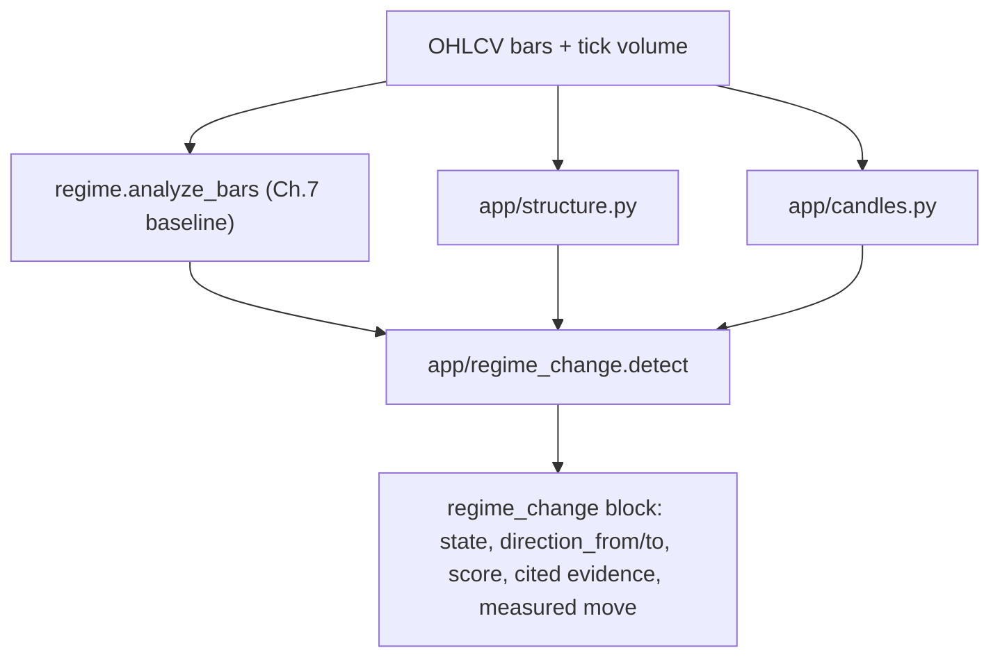

# Structural Regime-Change Framework (Iteration 3)

Research only. No orders. Evidence is heuristic and pinned to the **whole
corpus** (Murphy, Edwards & Magee, Pring, Nison, Lien). This is the first
iteration of a framework for analyzing probable market moves: **early detection
of a regime change, with subsequent confirmations.**

It sits on top of the Ch. 7 baseline ([docs/LIEN_FX_STRATEGIES.md](LIEN_FX_STRATEGIES.md),
`classify_regime`): the baseline answers "trend / range / mixed *now*"; this
framework answers "is the current regime *about to change*, in which direction,
and how strong is the evidence?"

## Pipeline

- `app/structure.py` - price structure: horizontal S/R levels (clustered
  swings + round-number figures + prior-bar H/L), S/R role reversal, valid
  trendline breaks (close + time + price/ATR filters), trend-channel state
  (failed leg toward the far rail + basic-rail break + measured move), the fan
  principle, and swing-structure flips.
- `app/candles.py` - secondary OHLCV confirmations: engulfing, doji variants,
  hammer / shooting star, dark-cloud / piercing, harami, and the Western key
  reversal day. Each is tagged with whether it prints at a structural level and
  whether **tick** volume expands (`volume_kind`).
- `app/regime_change.py` - merges the three into a staged, weighted, cited
  verdict, gated by event recency (below).

## Far-rail failure as a failed leg (the Iteration-3 fix)

`channel_far_rail_failure` used to compare the **high of the last four bars**
against the return rail and fire whenever the gap exceeded 25% of channel width.
Price sits in the lower three-quarters of a rising channel most of the time, so
that test was satisfied on **49.3% of bars** — a coin-flip-prevalence *state*
carrying a 0.15 early-warning weight, which then dominated `score`.

Murphy 4.17 reads the *inability of a rally to reach the return line*, which
presupposes an earlier rally that did reach it. The detector now requires both
legs, in order:

1. a completed swing (in the trend direction) whose extreme came within
   `FAR_RAIL_REACH_FRAC` (10% of width) of the far rail — the leg that **tagged**
   it; then
2. a **later** completed swing that fell short by at least
   `FAR_RAIL_FAIL_FRAC` (25%, unchanged) — the leg that **failed**; and
3. that failing swing still inside the channel (gap < one full width). Beyond a
   full width the swing sits at or past the basic rail, where the channel has
   already broken and `channel_basic_break` is the applicable signal.

`channel_state` returns `far_rail_failure_event` with the failing swing's index,
its `gap_frac`, and the `prior_reach_index` / `bars_since_reach` of the leg it
failed against, so the warning is dated and takes the same recency gate as every
other event. Fire rate: **49.3% -> 10.0%**.

This was a specificity fix, not an edge discovery. Split-validated the same way
as everything else, the sharpened signal still does **not** hold its directional
sign (whole sample lift −0.025, z = −1.93; +0.010 in 2015-2020 vs −0.060 in
2021-2026). Aggregate `direction_to` moved 0.481 -> 0.491, still below a coin
flip.

### State distribution across iterations

| State | Iteration 1 | Iteration 2 | Iteration 3 |
|-------|------------:|------------:|------------:|
| `stable` | 0.7% | 26.5% | **39.5%** |
| `early_warning` | 1.7% | 23.8% | **10.8%** |
| `confirming` | 54.0% | 47.5% | **48.9%** |
| `confirmed` | 43.6% | 2.2% | **0.8%** |

`confirmed` first-fires are now 132 across seven pairs over ~11.7 years, i.e.
**1.6 per pair-year** — a defensible rate for a confirmed structural regime
change on a daily chart, and the reason `CONFIRMED_THRESHOLD` was left at 0.6
despite the score distribution tightening (p90 = 0.30, p99 = 0.55). Lowering it
would be a tuning decision with no validated return basis.

`confirming` stays near half of all bars by construction — it means "at least
one fresh confirmation within 5 bars," and `candle_reversal_at_level` (24.4%)
plus `channel_basic_break` (16.9%) account for most of it.

## Event recency (the Iteration-2 fix)

`app/structure.py` answers "what is the most recent qualifying event anywhere in
the lookback window." Read without a recency bound, that is a **latched state,
not an event**: a trendline broken 50 bars ago keeps reporting as a confirmation
for as long as the 250-bar window holds it. Measured over 21,334 causal daily
bars on the seven USD majors:

| Signal | reported on | median age | p90 age |
|--------|------------:|-----------:|--------:|
| `trendline_break_valid` | 85.2% of bars | 53 bars | 131 |
| `sr_role_reversal` | 79.4% | 50 | 175 |
| `fan_*` (youngest broken line) | 60.9% | 45 | 125 |
| `candle_reversal_at_level` | 53.7% | 0 | 0 |

Only the candlestick detector was dating its own evidence. The other three
pushed `confirmed` to 43.6% of all bars and left `stable` at 0.7%, so the four
stages carried almost no information.

`EVENT_RECENCY_BARS = 5` now bounds how old a **discrete event** may be and
still count. Each evidence item carries its `age` (bars between the event and
the decision bar); `age: null` marks signals read off the current bar's close
(`trend_waning`, both channel rails, `swing_structure_flip`, `minor_sr_break`),
which need no gate. A stale trendline also no longer supplies a `measured_move`.
Pass `recency=` to `detect` to recover the unbounded behaviour for comparison.

Book weights and `CONFIRMED_THRESHOLD` are **unchanged** — the calibration came
from fixing staleness, not from tuning. Fire rates fell to
`trendline_break_valid` 6.5%, `sr_role_reversal` 5.3%, `fan_first_line` 6.3%,
`fan_third_line` 2.3%. See the cross-iteration table above for the resulting
state distribution.

## Calibration honesty: `direction_to` has no validated skill

Weights were **not** refitted, because there is nothing stable to fit them to.
Against an ATR-normalised 10-bar forward-move label (0.5·ATR·√h noise floor,
68% of bars resolve up/down), measured on the same 21,334 bars:

- Aggregate `direction_to` hit rate is **0.481** — slightly worse than a coin flip.
- Per-signal directional lift was checked on two independent splits, time
  (2015-2020 vs 2021-2026) and pair (EUR/GBP/JPY/CAD vs AUD/CHF/NZD). **No
  signal holds its sign across both folds of both splits at |z| >= 1.6.**
- The largest apparent effects are the least stable. `swing_structure_flip`
  measures lift −0.171 (z = −8.1) in 2015-2020 and **+0.065 (z = +2.9)** in
  2021-2026; `trendline_break_valid` flips −0.046 → +0.068 the same way.
  `trend_waning` is the only signal that is never negative in any fold, and it
  is weak (+0.001 to +0.105).

So `score` should be read strictly as its docstring says — a **structural
pressure index**, not a probability and not a directional forecast. Treat
`direction_to` as unvalidated. This is the measured explanation for the Stage-3
paper book returning −0.248 mean R over 99 trades: it opens reversal tickets on
a directional call that has no demonstrated edge. Re-running that walk is not
worthwhile until a directional signal survives the split test above.

Reproduce with the harnesses described in "Recalibration method" below.

## Staged states

The scorer collects **evidence items**, each with a stage, a deterministic
weight, and a corpus citation. The `score` is the capped weighted sum: a
risk-of-change reading, not a probability.

| State | Meaning | Trigger |
|-------|---------|---------|
| `stable` | no structural pressure | no evidence |
| `early_warning` | leading structural cracks (Stage 1 only) | warnings, no confirmations |
| `confirming` | one or more confirmations printed (Stage 2) | any confirmation, `score` < 0.6 |
| `confirmed` | enough weighted evidence to call it (Stage 3) | confirmations and `score` >= 0.6 |

Every trigger above is additionally subject to the recency gate: only evidence
whose event is within `EVENT_RECENCY_BARS` counts toward `score` or a stage.

`direction_to` is a weight-summed vote of the directional evidence, falling
back to the opposite of the prevailing trend — **unvalidated**, see above.
`measured_move` projects a target from the channel width or, when the break is
fresh, the broken trendline's pre-break vertical extent.

## Evidence catalog (weights and citations)

Weights and pins live in `app.regime_change.EVIDENCE_CATALOG`; the citations are
verified against detectors by `agent/structure_fidelity.py`. "Gated" marks
signals carrying a discrete event index, subject to `EVENT_RECENCY_BARS`; the
rest are read off the decision bar's close. "Fires" is the measured rate on
21,334 causal daily bars across the seven USD majors.

| Signal | Stage | Weight | Gated | Fires | Citation | Book rule |
|--------|-------|-------:|:-----:|------:|----------|-----------|
| `trend_waning` | early_warning | 0.10 | — | 5.6% | `pring-ta` 173 | high but rolling-over trend is running out of steam |
| `channel_far_rail_failure` | early_warning | 0.15 | yes | 10.0% | `murphy-digital` 53 | a rally that previously tagged the far rail now falls short |
| `minor_sr_break` | early_warning | 0.15 | — | 4.6% | `edwards-magee` 434 | breaking a minor support is the first step of a reversal |
| `fan_first_line` | early_warning | 0.10 | yes | 6.3% | `murphy-digital` 49 | first fan trendline broken |
| `trendline_break_valid` | confirming | 0.20 | yes | 6.5% | `murphy-digital` 47 | valid trendline break (close + time/price filter) |
| `channel_basic_break` | confirming | 0.15 | — | 16.9% | `murphy-digital` 53 | break of the basic channel rail is a trend-change signal |
| `sr_role_reversal` | confirming | 0.15 | yes | 5.3% | `murphy-digital` 43 | broken level holds its reversed role on retest |
| `swing_structure_flip` | confirming | 0.15 | — | 7.7% | `edwards-magee` 301 | failed new extreme then prior-swing break (Dow flip) |
| `candle_reversal_at_level` | confirming | 0.15 | yes | 24.4% | `nison-candlesticks` 99 | candlestick reversal at a structural level |
| `volume_pickup` | confirming | 0.10 | — | 6.9% | `edwards-magee` 449 | tick-volume expansion confirming the break |
| `fan_third_line` | confirming | 0.10 | yes | 2.3% | `murphy-digital` 49 | third fan trendline broken (move signalled) |

The weakest remaining entries are `candle_reversal_at_level` (24.4%) and
`channel_basic_break` (16.9%), which together drive `confirming` to roughly half
of all bars. The candlestick rate is arguably faithful — Nison patterns near a
level genuinely are common, and the detector correctly dates each one — so the
open question is whether 0.15 of *confirmation* weight suits an event that
frequent. `channel_basic_break` latches mildly (median run of 2 consecutive
bars, p90 8, and only 27% of its firing bars are the first bar of a break), so
dating it is a smaller version of the Iteration-2 fix. Neither was changed here:
both are judgement calls with no validated return basis, and the split test
below is what any such change has to clear first.

Supporting principle pins (no direct signal, verified in fidelity): trendline
validity `murphy-digital` 45; engulfing definition `nison-candlesticks` 59;
Lien Ch. 15 channels `lien-fx` 91.

`volume_pickup` only counts when a break or candlestick reversal is also
present. FX has no true traded volume, so volume is OANDA tick volume and is
always labeled `volume_kind="tick"`.

## Interfaces

- MCP tool `detect_regime_change` (`oanda-research`) and CLI
  `scripts/detect_regime_change.py` - fetch candles, return the staged block
  with cited evidence. Research/peek only.
- Backtestable walk: kind `regime_change` in `agent/walk_jobs.py`
  (`agent/regime_change_walk.py`). One causal pass yields two products:
  1. a **detection log** with a delayed, causal evaluation of whether the Ch. 7
     baseline actually flipped within `horizon` bars (lead time, precision,
     recall) using the same flip label as `app/regime_walk.py`. Read the flip
     rates with care: that label counts any baseline label churn, so its base
     rate is 71% at horizon 10 and 92% at horizon 20 — a high flip rate is
     mostly the base rate, not detector skill; and
  2. a **paper book**: a Stage-3 (`confirmed`) first-fire opens one reversal
     ticket at a time via `agent/levels.build_ticket` (>=2R) - direction from
     `direction_to`, stop beyond the recent 10-bar extreme, target from the
     measured move. Early warnings alone never trade. Two fill modes:
     `--fill close` (default) fills at the confirming bar's mid close and
     compounds equity via R; `--fill rest` (closer to broker behaviour) rests
     the ticket and fills at the **next** bar's taking-side open (long ask /
     short bid) with integer units, exiting on the making side (needs bid/ask
     bars, fetched automatically). Tickets flow through `WalkResult` / equity /
     `compact_walk_payload`.
- Fidelity: `python -m agent.structure_fidelity [--pin] [--search] [--corpus]`
  checks each claim's citation against `EVIDENCE_CATALOG` (lockstep), the
  detector's existence, catalog coverage, and (with `--pin`) the book phrase in
  the cited chunk.

## Recalibration method

The Iteration-2 numbers above come from replaying `detect` over the cached daily
bars in `data/walk_majors_regime_change_ew_2015/cache/` (seven USD majors,
2015-2026, 250-bar causal windows, 21,334 decision bars). The procedure, for
anyone repeating it on a new signal:

1. **Measure prevalence and event age** per signal. A signal firing on more than
   roughly a third of bars is a state, not an event, and cannot carry
   confirmation weight.
2. **Choose a label with a noise floor.** The existing
   `app.regime_walk.regime_changed` label is unusable for calibration: it counts
   any baseline label churn, so its base rate reaches 92% at horizon 20 and
   every detector scores near-perfect "recall" by doing nothing. Use an
   ATR-normalised forward move instead.
3. **Sweep the recency bound** (1, 2, 3, 5, 8, 13 bars) and re-measure. Gating
   moved `trendline_break_valid` from −0.030 lift to +0.010 and
   `sr_role_reversal` from +0.003 to +0.020, which is what identified staleness
   as the root cause rather than the weights.
4. **Validate on two independent splits before changing any weight or sign** —
   time and pair. Nothing here survived, which is why weights are unchanged.

Step 4 is the important one. The in-sample measurement offers several tempting
sign flips (`swing_structure_flip` at z = −8.1 looks like a strong inverted
signal) that reverse completely in the other fold.

## Causality and scope

Every walk decision at bar `i` uses only `bars[: i + 1][-lookback:]` - no
look-forward (same rule as `app/regime_walk.py`). The detector is symmetric
(it warns on both up->down and down->up changes) and works from a `trend` or a
`mixed` baseline. It does not place orders, does not infer news/events, and
treats risk reversals / implied vol as unavailable.

The recency gate is itself causal: an event's age is measured backward from the
decision bar, so gating never consults a future bar.

## Not in this iteration

- No new live entry engine in the Ch. 8-16 registry (detection != entry).
- No multi-timeframe confirmation (single TF per run).
- **No refitted weights or signs** - nothing survived the split validation, so
  the book weights and `CONFIRMED_THRESHOLD = 0.6` stand unchanged. Iteration 3
  changed a *detector's definition* to match its book rule, never a weight.
- No dating of `channel_basic_break` and no reweighting of
  `candle_reversal_at_level`, the two remaining drivers of `confirming`.
- No re-run of the Stage-3 paper book; `direction_to` is unvalidated, so the
  stored campaign results under `data/walk_usd_jpy_regime_change_2015/` are
  stale with respect to this iteration and should not be quoted as current.
