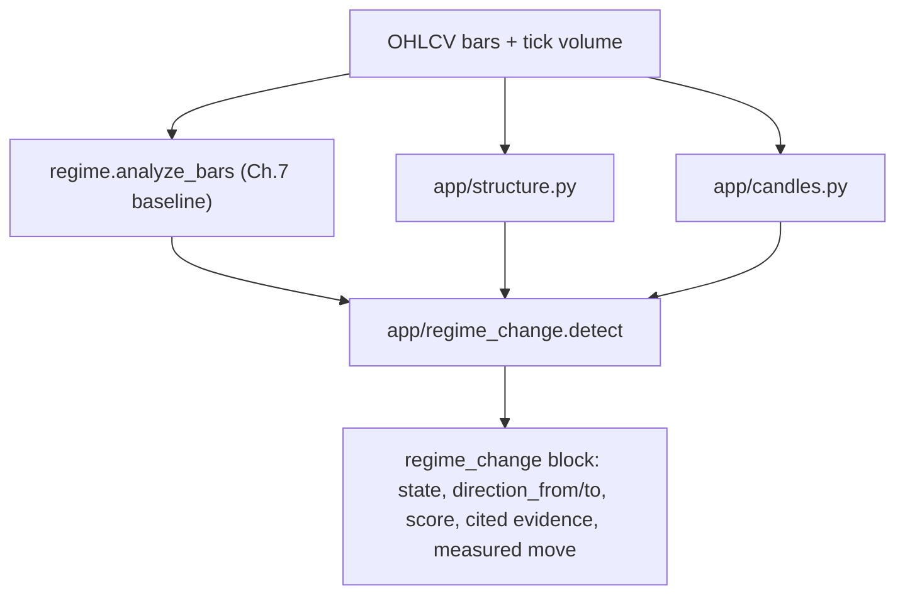

# Structural Regime-Change Framework (Iteration 1)

Research only. No orders. Evidence is heuristic and pinned to the **whole
corpus** (Murphy, Edwards & Magee, Pring, Nison, Lien). This is the first
iteration of a framework for analyzing probable market moves: **early detection
of a regime change, with subsequent confirmations.**

It sits on top of the Ch. 7 baseline ([docs/LIEN_FX_STRATEGIES.md](LIEN_FX_STRATEGIES.md),
`classify_regime`): the baseline answers "trend / range / mixed *now*"; this
framework answers "is the current regime *about to change*, in which direction,
and how strong is the evidence?"

## Pipeline

- `app/structure.py` - price structure: horizontal S/R levels (clustered
  swings + round-number figures + prior-bar H/L), S/R role reversal, valid
  trendline breaks (close + time + price/ATR filters), trend-channel state
  (far-rail failure + basic-rail break + measured move), the fan principle, and
  swing-structure flips.
- `app/candles.py` - secondary OHLCV confirmations: engulfing, doji variants,
  hammer / shooting star, dark-cloud / piercing, harami, and the Western key
  reversal day. Each is tagged with whether it prints at a structural level and
  whether **tick** volume expands (`volume_kind`).
- `app/regime_change.py` - merges the three into a staged, weighted, cited
  verdict.

## Staged states

The scorer collects **evidence items**, each with a stage, a deterministic
weight, and a corpus citation. The `score` is the capped weighted sum: a
risk-of-change reading, not a probability.

| State | Meaning | Trigger |
|-------|---------|---------|
| `stable` | no structural pressure | no evidence |
| `early_warning` | leading structural cracks (Stage 1 only) | warnings, no confirmations |
| `confirming` | one or more confirmations printed (Stage 2) | any confirmation, `score` < 0.6 |
| `confirmed` | enough weighted evidence to call it (Stage 3) | confirmations and `score` >= 0.6 |

`direction_to` is a weight-summed vote of the directional evidence, falling
back to the opposite of the prevailing trend. `measured_move` projects a target
from the channel width or the broken trendline's pre-break vertical extent.

## Evidence catalog (weights and citations)

Weights and pins live in `app.regime_change.EVIDENCE_CATALOG`; the citations are
verified against detectors by `agent/structure_fidelity.py`.

| Signal | Stage | Weight | Citation | Book rule |
|--------|-------|-------:|----------|-----------|
| `trend_waning` | early_warning | 0.10 | `pring-ta` 173 | high but rolling-over trend is running out of steam |
| `channel_far_rail_failure` | early_warning | 0.15 | `murphy-digital` 53 | failure to reach the far channel rail warns the trend is shifting |
| `minor_sr_break` | early_warning | 0.15 | `edwards-magee` 434 | breaking a minor support is the first step of a reversal |
| `fan_first_line` | early_warning | 0.10 | `murphy-digital` 49 | first fan trendline broken |
| `trendline_break_valid` | confirming | 0.20 | `murphy-digital` 47 | valid trendline break (close + time/price filter) |
| `channel_basic_break` | confirming | 0.15 | `murphy-digital` 53 | break of the basic channel rail is a trend-change signal |
| `sr_role_reversal` | confirming | 0.15 | `murphy-digital` 43 | broken level holds its reversed role on retest |
| `swing_structure_flip` | confirming | 0.15 | `edwards-magee` 301 | failed new extreme then prior-swing break (Dow flip) |
| `candle_reversal_at_level` | confirming | 0.15 | `nison-candlesticks` 99 | candlestick reversal at a structural level |
| `volume_pickup` | confirming | 0.10 | `edwards-magee` 449 | tick-volume expansion confirming the break |
| `fan_third_line` | confirming | 0.10 | `murphy-digital` 49 | third fan trendline broken (move signalled) |

Supporting principle pins (no direct signal, verified in fidelity): trendline
validity `murphy-digital` 45; engulfing definition `nison-candlesticks` 59;
Lien Ch. 15 channels `lien-fx` 91.

`volume_pickup` only counts when a break or candlestick reversal is also
present. FX has no true traded volume, so volume is OANDA tick volume and is
always labeled `volume_kind="tick"`.

## Interfaces

- MCP tool `detect_regime_change` (`oanda-research`) and CLI
  `scripts/detect_regime_change.py` - fetch candles, return the staged block
  with cited evidence. Research/peek only.
- Backtestable walk: kind `regime_change` in `agent/walk_jobs.py`
  (`agent/regime_change_walk.py`). One causal pass yields two products:
  1. a **detection log** with a delayed, causal evaluation of whether the Ch. 7
     baseline actually flipped within `horizon` bars (lead time, precision,
     recall) using the same flip label as `app/regime_walk.py`; and
  2. a **paper book**: a Stage-3 (`confirmed`) first-fire opens one reversal
     ticket at a time via `agent/levels.build_ticket` (>=2R) - direction from
     `direction_to`, stop beyond the recent 10-bar extreme, target from the
     measured move. Early warnings alone never trade. Two fill modes:
     `--fill close` (default) fills at the confirming bar's mid close and
     compounds equity via R; `--fill rest` (closer to broker behaviour) rests
     the ticket and fills at the **next** bar's taking-side open (long ask /
     short bid) with integer units, exiting on the making side (needs bid/ask
     bars, fetched automatically). Tickets flow through `WalkResult` / equity /
     `compact_walk_payload`.
- Fidelity: `python -m agent.structure_fidelity [--pin] [--search] [--corpus]`
  checks each claim's citation against `EVIDENCE_CATALOG` (lockstep), the
  detector's existence, catalog coverage, and (with `--pin`) the book phrase in
  the cited chunk.

## Causality and scope

Every walk decision at bar `i` uses only `bars[: i + 1][-lookback:]` - no
look-forward (same rule as `app/regime_walk.py`). The detector is symmetric
(it warns on both up->down and down->up changes) and works from a `trend` or a
`mixed` baseline. It does not place orders, does not infer news/events, and
treats risk reversals / implied vol as unavailable.

## Not in this iteration

- No new live entry engine in the Ch. 8-16 registry (detection != entry).
- No multi-timeframe confirmation (single TF per run).
